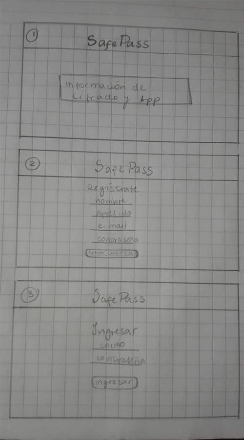
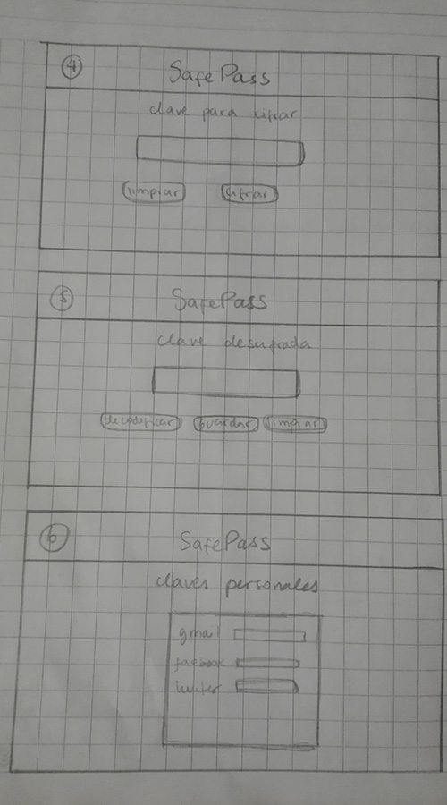
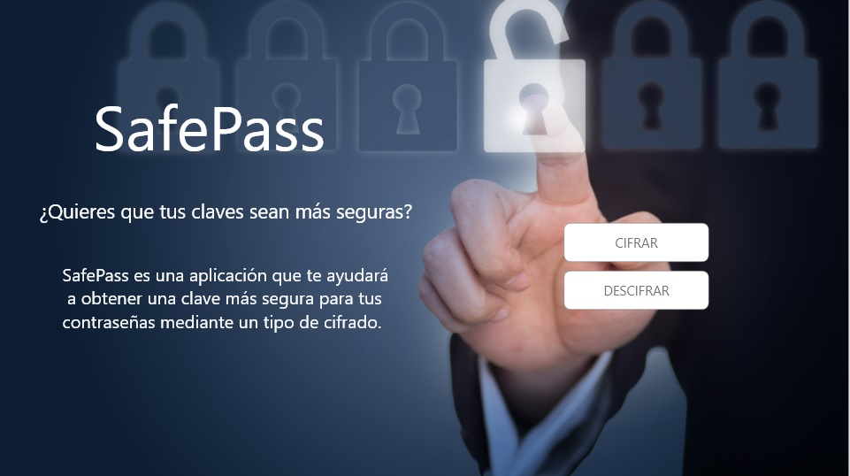
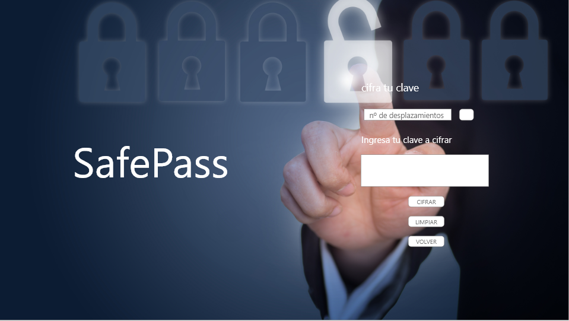

# SafePass

SafePass es una aplicación que te permite crear contraseñas más seguras para tus cuentas, ya sea redes sociales u otras, a través de un tipo de cifrado.

## Público objetivo

SafePass está dirigida a toda persona que necesite una mayor seguiridad en sus contraseñas, específicamente para:

- Hombres y mujeres
- Rango etario: desde 20 a 50 años de edad.

## Prototipo 

- Prototipo de baja fidelidad

- Prototipo de alta fidelidad

#### Pantalla de inicio

