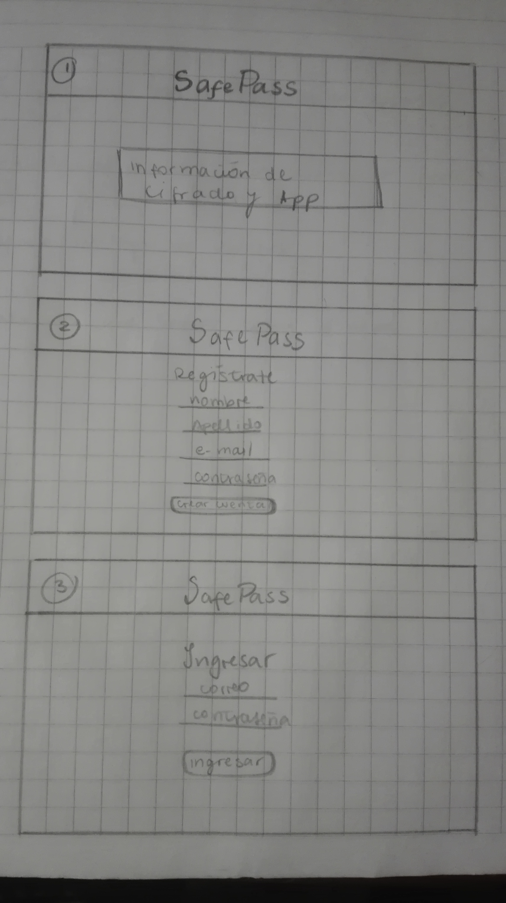
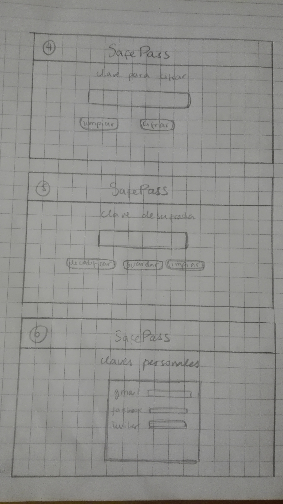

# SafePass

SafePass es una aplicación que te permite crear contraseñas más seguras para tus cuentas, ya sea redes sociales u otras, a través de un tipo de cifrado.

## Público objetivo

SafePass está dirigida a toda persona que necesite una mayor seguiridad en sus contraseñas, específicamente para:

- Hombres y mujeres
- Rango etario: desde 20 a 50 años de edad.

## Prototipo 

- **Planificación, organización y manejo del tiempo** : 

#### Definición del producto

En el README.md, cuéntanos cómo pensaste en los usuarios y cuál fue tu proceso para definir el producto final a nivel de experiencia y de interfaz.

- Quiénes son los principales usuarios de producto.
- Cuáles son los objetivos de estos usuarios en relación con tu producto.
- Cómo crees que el producto que estás creando está resolviendo sus problemas.

## Recursos y temas relacionados

A continuación un video de Michelle que te lleva a través de la fórmula
matemática del Cifrado César y un par de cosas más que debes saber para
resolver este proyecto. ¡Escúchala con detenimiento y sigue sus consejos! :)

